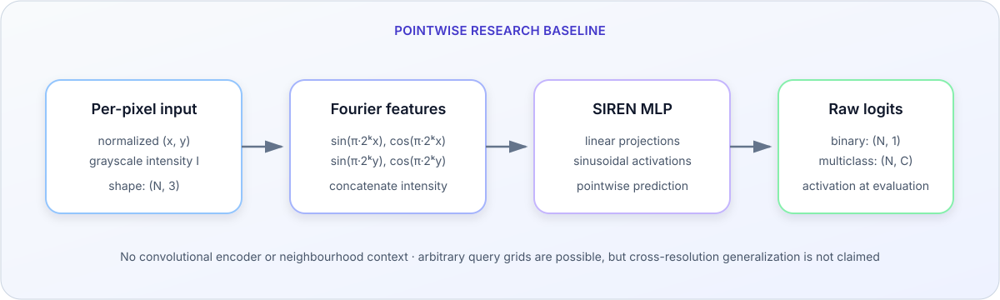

# Retinal Vessel Segmentation with Implicit Neural Representations

<p align="center">
  <strong>A reproducibility-focused archive of a completed exploratory research project</strong>
</p>

<p align="center">
  <a href="https://github.com/GiovanniFilomeno/Retina_segmentation_with_Implicit_Neural_Representation/actions/workflows/ci.yml"></a>
  
  
  <a href="LICENSE"></a>
  
</p>

This repository investigates a simple question: **can a pointwise implicit neural
representation (INR), conditioned on pixel position and intensity, act as a useful
baseline for retinal vessel segmentation?** It presents a maintained SIREN-inspired
PyTorch implementation and an explicit account of the project's evidence boundary.

The work was completed by **Giovanni Filomeno** in research collaboration with
researchers at the Medical University of Vienna. This is an independently
maintained project archive, not an official institutional publication. The
affiliation statement does not imply institutional review, approval, or endorsement.

> [!IMPORTANT]
> This repository publishes **no validated benchmark results and no trained
> checkpoints**. Values in superseded exploratory artifacts are not presented as
> test-set metrics.
> The maintained package and synthetic checks document the implementation; they do
> not establish clinical or scientific performance.

## Project status

The research project is complete and is not undergoing new model training. The
repository was subsequently hardened for public inspection: packaging, input/output
contracts, synthetic tests, documentation, and continuous integration are maintained
without retroactively inventing experimental evidence.

- **Available:** reusable model and preprocessing code, loss functions, synthetic
  CPU checks, tests, configuration examples, and an unexecuted smoke-test notebook.
- **Not available:** datasets, model weights, complete run logs, frozen split
  manifests from the original study, or validated benchmark reports.
- **Intended use:** study, code review, and extension as a research baseline.
- **Not intended use:** diagnosis, treatment, screening, or any other clinical
  decision.

For a concise account of the study and its evidentiary boundary, read the
[research note](docs/research_note.md). For exact environment and data caveats, see
[the reproducibility guide](docs/reproducibility.md).

## Method

Each pixel is represented by normalized coordinates and grayscale intensity:

$$
f_\theta(x, y, I) \rightarrow \text{segmentation logits}.
$$

The coordinates are expanded with Fourier features, concatenated with intensity,
and processed by a sinusoidal multilayer perceptron. Binary models emit one raw
logit per point; multiclass models emit one raw logit per class. Activations needed
for probabilities belong in evaluation code (`sigmoid` or `softmax`), keeping the
model compatible with numerically stable logit-based losses.



This is deliberately a **pointwise research baseline**. It is not a U-Net and does
not learn a neighbourhood-aware image encoder. Querying a coordinate function on a
different grid is mechanically possible, but resolution generalization was not
validated in this project and is not claimed here.

## Maintained engineering scope

- Explicit binary one-logit and multiclass K-logit contracts, with probability
  transforms kept outside the model.
- Numerically stable focal–Dice objectives operating directly on logits.
- Image/mask pairing by validated identifiers, strict label-value checks, and shared
  geometric augmentation without photometric mask corruption.
- One coordinate convention for training and inference, exact odd-size patch
  reconstruction, and chunked full-image prediction.
- Pure per-image binary and multiclass metrics plus regression tests that verify the
  evaluator uses masks and preserves pixel alignment across patches.
- CPU-only synthetic smoke checks, automated tests, formatting, linting, and GitHub
  Actions CI. These establish software contracts, not model quality.

## Scientific limitations

- A prediction sees only its coordinate and local intensity. The model has no
  explicit access to adjacent texture, vessel continuity, or multiscale context.
- Coordinates can be local to a patch, so the learned function is not necessarily a
  globally consistent representation of a full retina.
- The FIVES loader converts color fundus photographs to grayscale; the information
  loss from that design choice was not measured.
- The superseded experiments do not provide the controlled baselines, multiple seeds,
  held-out metrics, confidence intervals, or provenance required for a benchmark
  claim.
- Training loss is neither a segmentation metric nor evidence of generalization.
- Cross-resolution behavior, domain shift, calibration, and robustness were not
  established.
- FIVES and RAVIR have distinct modalities, labels, licenses, and evaluation
  protocols; observations should not be transferred between them without study.

These limitations define the evidence boundary: the repository preserves a compact,
inspectable hypothesis and makes clear what would need to be tested next.

## Synthetic quick start

The following path requires no retinal data, checkpoint, or GPU. It verifies tensor
shapes, finite outputs, preprocessing, loss execution, and a backward pass on
synthetic inputs.

```bash
git clone https://github.com/GiovanniFilomeno/Retina_segmentation_with_Implicit_Neural_Representation.git
cd Retina_segmentation_with_Implicit_Neural_Representation

python -m venv .venv
source .venv/bin/activate  # Windows PowerShell: .\.venv\Scripts\Activate.ps1
python -m pip install --upgrade pip
python -m pip install -e '.[dev]'

python -m retina_inr.smoke
```

The command runs on CPU and exits with a non-zero status if a check fails. It is a
software smoke test, not a scientific evaluation. A matching, intentionally
unexecuted notebook is available at
[`notebooks/01_synthetic_smoke_test.ipynb`](notebooks/01_synthetic_smoke_test.ipynb).

Run the complete software test suite with:

```bash
pytest
```

## Minimal API example

```python
import torch

from retina_inr import INRSegmentationModel

model = INRSegmentationModel(
    task="binary",
    hidden_dim=32,
    num_layers=2,
    num_freqs=3,
).eval()

# One row per point: [x_normalized, y_normalized, intensity_normalized]
coords = torch.rand(64, 2) * 2.0 - 1.0  # x and y in [-1, 1]
intensities = torch.rand(64, 1)         # grayscale intensity in [0, 1]
features = torch.cat((coords, intensities), dim=1)
with torch.inference_mode():
    logits = model(features)

assert logits.shape == (64, 1)
```

Inputs must follow the normalization and label conventions documented in the package.
Do not load untrusted checkpoint files with unrestricted deserialization.

## Data

The datasets are not redistributed. Obtain them from their maintainers and review
their terms before use.

| Dataset | Research task in this repository | Official source |
| --- | --- | --- |
| FIVES | Binary vessel/background segmentation in color fundus images | [Dataset record on Figshare](https://figshare.com/articles/figure/FIVES_A_Fundus_Image_Dataset_for_AI-based_Vessel_Segmentation/19688169) · [paper](https://doi.org/10.1038/s41597-022-01564-3) |
| RAVIR | Background/artery/vein segmentation in infrared reflectance images | [Grand Challenge page](https://ravir.grand-challenge.org/) · [paper](https://doi.org/10.1109/JBHI.2022.3163352) |

Expected local layout:

```text
data/
├── README.md
├── FIVES/
│   ├── train/
│   │   ├── Original/
│   │   └── Ground truth/
│   └── test/
│       ├── Original/
│       └── Ground truth/
└── RAVIR/
    ├── train/
    │   ├── training_images/
    │   └── training_masks/
    └── test/
```

See [`data/README.md`](data/README.md) for pairing rules, label handling, and the
boundary between dataset-defined and repository-defined conventions.

## Reproducibility boundary

The maintained package can be rebuilt and checked from source using the commands
above. The original scientific runs cannot be reproduced exactly from this archive
because the original artifacts needed for an auditable rerun were not retained.
Accordingly:

- superseded exploratory notebooks are recoverable from Git history, not maintained
  executable result reports;
- configs describe candidate settings, not certified published experiments;
- tests establish software behavior on synthetic fixtures only; and
- any future benchmark must define splits before training, preserve environment and
  checkpoint provenance, report per-image segmentation metrics, and compare against
  appropriate baselines.

The full checklist is in [`docs/reproducibility.md`](docs/reproducibility.md).

## Repository guide

```text
.
├── src/
│   └── retina_inr/             # Maintained installable package
├── tests/                      # Synthetic unit and contract tests
├── configs/                    # Reproducible configuration examples
├── notebooks/
│   └── 01_synthetic_smoke_test.ipynb
├── docs/                       # Research and reproducibility notes
├── data/README.md              # Data acquisition and expected layout
├── references/                # Bibliography and third-party reference material
├── pyproject.toml              # Package metadata and development dependencies
├── CITATION.cff
└── THIRD_PARTY_NOTICES.md
```

Superseded notebooks, prototype code, binary literature copies, and vendored reference
implementations were removed from the maintained tree. They remain recoverable from
Git history when provenance work requires them. New code and examples should import
`retina_inr`.

## Collaboration and authorship

- **Giovanni Filomeno:** project implementation, exploratory experimentation,
  repository maintenance, and public archival documentation.
- **Research collaborators at the Medical University of Vienna:** research
  discussion and domain context during the completed collaboration.

No institutional authorship or endorsement is asserted. If you contributed to the
original work and want your role named more precisely, please open an issue with the
requested attribution.

## Citation

This repository is software and an exploratory research archive, not a peer-reviewed
paper. Cite the archived version described in [`CITATION.cff`](CITATION.cff), and
cite the original datasets and methods separately. Core literature is listed in
[`references/README.md`](references/README.md).

## Contributing

Maintenance contributions that improve correctness, tests, documentation, or
reproducibility are welcome. New performance claims require auditable evidence; see
[`CONTRIBUTING.md`](CONTRIBUTING.md) before opening a pull request.

## License and responsible use

First-party source code is released under the [MIT License](LICENSE). Dependencies,
datasets, and third-party material in earlier Git revisions retain their original
terms; see [`THIRD_PARTY_NOTICES.md`](THIRD_PARTY_NOTICES.md).

This software is provided for research and educational use. It is **not a medical
device**, has not been clinically validated, and must not be used for patient care or
clinical decision-making.
